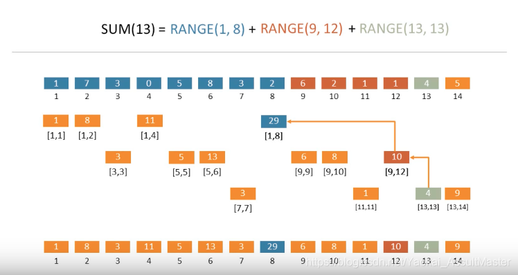

<!--
 * @Date: 2022-09-04 18:57:15
 * @LastEditors: zhangjiuchao zhangjiuchao@bytedance.com
 * @LastEditTime: 2022-09-04 22:38:20
-->
树状数组
==============

树状数组类似于前缀和的思想，修改和查询的时间复杂度均为$log(n)$，主要用于数组的**单点修改**和**区间求和**。

树状数组能解决的典型问题就是针对一个长度为n的数组，可以高效的进行以下操作:
- update(idx, delta), 将delta加到位置为idx的数字上
- prefixSum(idx)，求数组第一个位置到位置idx之间（包含idx）所有的数字之和
- rangeSum(from_idx, to_idx), 求数组从from_idx到to_idx之间所有数字的和

对于这个问题，可以存储数组的前缀和，即位置idx存储位置1～idx之间的所有数字和，但是每次调用update(idx, delta)，都需要更新位置idx后的每一个前缀和，时间复杂度为$O(n)$，当数组的更新操作较多时，这种方法就不太实用了。

树状数组能够在保证求和操作依然高效的情况下，大幅度优化更新操作的时间复杂度。

树状数组并不是一颗树，而是利用数字的二进制表示对数组中的数字进行逻辑上的分层与存储，比如对于idx=13，其二进制表示为*1101*，可以用二进制来对进行分段求和，13 = 8 + 4 + 1，因此prefixSum = range(1, 8) + range(9, 12), range(13, 13)，其中range(x, y)表示位置x~y之间的所有数字之和， 比如以下例子：
```
arr = [1, 7, 3, 0, 5, 8, 3, 2, 6, 2, 1, 1, 4, 5]
prefixSum(13) = range(1, 8) + range(9, 12) + range(13, 13)
= 29 + 10 + 4 = 43
```

如果我们将range(x, y）提前存储好，那么prefixSum(a)就能直接加和得到。树状数组就是需要解决如何来计算和存储这样的分段和，规则如下：

1. 第一层为原始数组，2、3、4层一次为按坑填值的过程，我们需要按从上到下，从左到右的过程一次将值填到对应的过程，最后一层就是最终得到的树状数组
2. 以第二层为例，需要从位置1开始，依次填充长度为$2^x$的区间和，因此我们分别填充了位置$2^0、2^1、2^2、2^3$处的区间和，因为$2^4$超过了数组长度，到这里就结束了
3. 接下来一层需要填充数组余下的空白区间的数字，依然从空白区间的第一个数字开始，依次填充长度为$2^x$的区间和，直到长度超过空白区间。例如空白区间**3-3**，只需从位置3开始，填充长度为1的区间和即可；对于空白区间**7-8**, 需要从位置7开始，填充长度为1和2的区间和；对于空白区间**9-14**, 需要从位置9开始，填充长度为1、2、4的区间和
4. 接下来重复操作3，知道所有空白位置都填充完毕，就可以得到一颗树状数组，记为**BIT**。

如此依赖，我们就解决了如果存储rangeSum的问题，则求和prefixSum(13)的过程就如下图所示了：


由上图可以看到，利用树状数组求解前缀和其实就是沿着树状数组表示的逻辑分层，逐层向上寻找父节点并求和的过程。树状数组表示的逻辑树如下所示：


那么需要怎么由代码实现组成向上寻找父节点的过程呢，依然看这个例子
```
prefixSum(13) = prefixSum(0b1101)
 = BIT(13) + BIT(12) + BIT(8)
 = BIT(0b1101) + BIT(0b1100) + BIT(0b1000)
```

可以发现，在这个抽象树逐渐向上移动的过程其实就是将当前数字中的最后一个1翻转成0的过程，这个过程可以由一下操作实现：
```
x = 13 = 0b00001101
-x = -13 = 0b11110011
x & (-x) = 0b00000001
x - (x & (-x)) = 0b00000001
```
定义操作 $lowbit(x) = x & (-x)$

## 更新操作update(idx, delta)
当我们调用update(idx,, delta)更新了数组中的数字后，也需要更新树状数组中相应的区间和，来应对这一改变

以update(5, 2)为例，我们将原数组位置5的数字加上2，然后树状数组的更新操作如下图所示：


可以发现，从位置5开始，需要更新的位置为原位置加上原位置最后一个1表示的数字，这个过程和求prefixSum中寻找父节点的过程相反：
```
x = 5 = 0b00000101
-x = -5 = 0b11111011
x & (-x) = 0b00000001
x + (x & (-x)) = 0b00000110
```

## 建立树状数组

树状数组的建立非常简单，先将树状数组初始化0数组，然后对原数组arr的每一个位置调用update(idx, arr[idx])来构建树状数组，时间复杂度为$n*log(n)$

还有一个时间复杂度为$0(n)$的方法，对于长度为n的数组arr。

1. 初始化一个长度为n+1的数组bit，然后将arr的数字放在bit[1]~bit[n]的位置
2. 对于1～n的每一个数字i，执行以下操作: j=x+(x&(-x)), 如果j < n + 1，则bit[j] = bit[j] + bit[i]

## 时间复杂度
根据上面的分析可知，树状数组的update和prefixSum操作的时间复杂度为$O(log(n))$，初始化操作为$O(n*log(n))$ 或 $O(n)$。

## 代码实现

```c++
#define lowbit(x) x&(-x)

class BinaryIndexTree() {
public: 
    BinaryIndexTree(vector<int> nums) {
        int n = num.size();
        bitArr.resize(n+1);
        for (int i = 0; i < n; ++i) {
            bitArr[i+1] = nums[i];
        }

        for (int i = 1; i < n; ++i) {
            int j = i + lowbit(i);
            if (j < n + 1) {
                bitArr[j] += bitArr[i];
            }
        }
    }

    // Add delta to nums[idx]
    void update(int idx, int delta) {
        idx += 1;
        while (idx < n + 1) {
            bitArr[idx] += delta;
            idx += lowbit(idx);
        }
    }

    int prefixSum(int idx) {
        int sum = 0;
        idx += 1;
        while (idx > 0) {
            sum += bitArr[idx];
            idx -= lowbit(idx);
        }
        return sum;
    }
private:
    vector<int> bitArr;
}

```