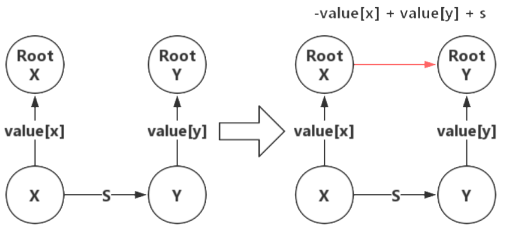

并查集
===================

# 算法简介
并查集是一种树形的数据结构，并查集也叫做不相交集数据结构，可以用来处理一些不相交数据集合的查询问题，是一种用来管理元素分组情况的数据结构。“并”、“查”、“集”这三个字分别取自于Union(合并)、Find（查询）、Set（集合）这三个单词，也就是说并查集支持合并及查询操作。

并查集主要有两个操作：
1. 合并：将两个不相交的集合合并成一个集合。
2. 查询：确定元素属于哪个集合，可以用来判断两个元素是否属于一个集合。

并查集通过一维数组arr[]来实现，其中arr[i]表示元素i的父节点，而父节点也是这个集合中的元素，例如arr[1] = 2，表示元素1的父节点是元素2，即元素1和元素2属于同一个集合。如果arr[i] == i，说明元素i是集合的根节点，集合的根结点有且只有一个，故可将其作为所属集合的标志。

# 基本操作
并查集的使用需要先进行初始化，再根据需要进行元素集合的查询与合并。

1、集合初始化

每个元素组成一个集合，集合的根节点就是元素本身。
```c++
int arr[N];
void Init(int) {
	for (int i = 0; i < n; ++i) {
		arr[i] = i;
	}
}
```

2、查询

由于规定集合有且只有一个根节点，所有查询操作就是对给定的节点寻找其根节点的过程，即反复寻找父节点，知道找到根节点位置（arr[i]==i），可以采用while循环和递归实现。判断两个元素是否属于同一个集合，只需要看他们的父节点是否相同即可。
```c++
// 循环实现
int Find(int x) {
	while (arr[x] != x) {
		x = arr[x];
	}
	return x;
}

// 递归实现
int Find(int x) {
	if (arr[x] != x) {
		return Find[arr[x]];
	}
	return x;
}
```

3、合并

合并是指把两个不同元素a和b所在的集合合并成一个集合，通常是先判断两个元素a和b是否属于同一个集合，如果不属于同一个集合才进行合并操作。合并的过程是将其中一个集合的根节点的父节点指向另一个集合的根节点。

- 对于两个元素a、b，先调用Find函数判断a和b是否属于同一个集合
- 在上一步已经获得两个集合的根节点pa和pb的情况下，只需要把其中一个根节点的父节点指向另一个根节点，例如arr[pa] = pb;
```c++
void Union(int a, int b) {
	int pa = Find(a);
	int pb = Find(b);
	if (pa != pb) {
		arr[pa] = pb;
	}
}
```

以上就是并查集最基本的操作，但是随着元素的增多，这样创建的树会越来越深，Find操作需要遍历的路径也会越来越长，每次调用Find花费的时间就会越来越多了。

因此需要对并查集的操作进行优化，主要有路径压缩和按秩合并。


# 路径压缩
上面提到的查询操作是没有进行优化的，当数据规模比较大时，元素集合容易形成一条很长的链，这时查询操作的效率非常低。可以采用路径压缩对查询操作进行优化，路径压缩是指在查询的过程中扁平化树结构的方法，因为我们只关心元素所属集合的根节点是谁，因此我们期望元素到根节点的路径尽可能短，最好是一步就可以达到。因此在进行查询操作时，我们可以将路径中的每一个节点都直接指向根节点，这样下次就可以直接查询到根节点了。

```c++
// 循环实现
int Find(int x) {
	int a = x;
	while (arr[x] != x) {
		x = arr[x];
	}

	while (arr[a] != a) {
		int z = arr[a];
		arr[a] = x;
		a = z;
	}
	return x;
}

// 递归
int Find(int x) {
	if (x == arr[x]) {
		return x;
	} else {
		arr[x] = Find[arr[x]];
		return arr[x];
	}
}
```
路径压缩之后，并查集的时间复杂度已经很低了，大部分不相交集合的查询与合并问题都能解决，如果时间卡的比较近，还可以通过按秩合并进一步优化时间复杂度。

# 按秩合并
按秩合并就是指在合并操作的时候，将秩小的集合连接到秩大的集合，这里的秩指树的深度，因为用了路径压缩之后，秩将不会和树深度相同。将秩小的集合连接到秩大的集合将不会增加新集合的秩，除非原来的两个集合秩相同。如果两个秩同为r的集合合并时，新集合的秩为r+1，否则新集合的秩与秩较大的集合相同。

可以用一个数组rank[]来表示集合的秩，rank[i]以i为根节点的集合的秩，如果i不是根节点，rank[i]没有意义，一开始rank[]都初始化为0。
```c++
int arr[N], rank[N]；
void Init(int n) {
	for (int i = 0; i < n; ++i) {
		arr[i] = i;
		rank[i] = 0;
	}
}

void Union(int a, int b) {
	int pa = Find(a);
	int pb = Find(b);
	if (pa == pb)	return;
	if (rank[pb] > rank[pa]) {
		arr[pa] = pb;
	} else {
		arr[pb] = pa;
	}
	if (rank[pa] == rank[pb]) {
		rank[pa] ++;
	}
}
```

同时使用路径压缩和按秩合并之后，并查集的平均操作时间将是一个非常小的常数。

# 带权并查集
普通并查集仅仅记录了集合的关系，这种关系无非是在一个集合或者不在一个集合。

带权并查集不仅记录了集合的关系，还记录了集合内元素的关系，或者是说元素连接线的权重。

普通并查集的本质是不带权重的图，带权并查集是带权重的图。

考虑到权重就会有以下问题。
1. 每个节点记录的是与根节点之间的权重，在查询操作中，更新节点的父节点时，需要同时更新节点的权重。
2. 在两个并查集合并时，也需要更新相应的权重，因为集合有不同的根节点，这里可以只更新原来两个根节点间的权重，其他节点的权重可以延迟更新（下次调用Find操作时更新）。

## 向量偏移法
对于集合里的任意两个元素x，y而言，它们之间必定存在着某种联系，因为并查集中的元素均是有联系的（这点是并查集的实质，要深刻理解），否则也不会被合并到当前集合中，那么我们就把这2个元素之间的关系量转化为一个偏移量

## 路径压缩
```c++
int Find(int x) {
	if (arr[x] == x) {
		return x;
	} else {
		int t = arr[x];
		arr[x] = Find(arr[x]);
		values[x] += values[t];
		return arr[x];
	}
}
```
因为在路径压缩后父节点直接变为根节点，此时父节点的权值已经是父节点到根节点的权值了，将当前节点的权值加上原本父节点的权值，就得到当前节点到根节点的权值

## 合并
已知x，y根节点分别为xRoot，yRoot，如果有了x、y之间的关系，合并如果不考虑权值直接修改parent就行了，但是现在是带权并查集，必须得求出xRoot与yRoot这条边的权值是多少，很显然x到yRoot两条路径的权值之和应该相同，就不难得出上面代码所表达的更新式



```c++
void Union(int x, int y) {
	int rootX = Find(x);
	int rootY = Find(y);
	if (rootX != rootY) {
		arr[rootX] = rootY;
		valus[rootX] = value[y] + s - valus[x]
	}
}
```