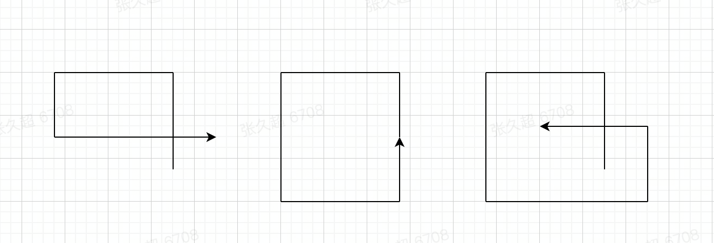

<!--
 * @Date: 2022-08-21 21:21:53
 * @LastEditors: zhangjiuchao zhangjiuchao@bytedance.com
 * @LastEditTime: 2022-08-21 21:43:17
-->
# 判断线段轨迹是否相交
[https://leetcode.com/problems/self-crossing/](https://leetcode.com/problems/self-crossing/)

# 题目描述
```
You are given an array of integers distance.

You start at point (0,0) on an X-Y plane and you move distance[0] meters to the north, then distance[1] meters to the west, distance[2] meters to the south, distance[3] meters to the east, and so on. In other words, after each move, your direction changes counter-clockwise.

Return true if your path crosses itself, and false if it does not.


Example 1:

Input: distance = [2,1,1,2]
Output: true

Example 2:

Input: distance = [1,2,3,4]
Output: false

Example 3:

Input: distance = [1,1,1,1]
Output: true
 

Constraints:

1 <= distance.length <= 105
1 <= distance[i] <= 105
```


# 解题思路
题意要求是给定一组逆时针行走的距离，判断路线轨迹是否相交。

可以想到只有在路线范围逐渐缩小或者扩大时，轨迹才不会相交，如下图


因此只需要考虑最近的几条线段是否相交即可（因为在与更远的轨迹相交之前，会提前和最近的几条线段相交），几种相交的情况如下图(可旋转)：


1. 第i根线条与第i-3根线条相交，$distance[i] \ge distance[i-2] \quad \& \quad distance[i-1] \le distance[i-3]$
2. 第i根线条与第i-4根线条相交
3. 第i根线条与第i-5根线条相交

本题的关键是需要分析出相交的多种情况，对问题进行简化。

# 代码实现
```c++
class Solution {
public:
    bool isSelfCrossing(vector<int>& distance) {
        int n = distance.size();
        if (n < 4)  return false;
        for (int i = 3; i < n; ++i) {
            if (distance[i] >= distance[i-2] && distance[i-1] <= distance[i-3]) return true;
            if (i > 3 &&
               distance[i-1] == distance[i-3] && distance[i] + distance[i-4] >= distance[i-2])
                return true;
            if (i > 4 &&
                (distance[i-2] >= distance[i-4]) &&
               (distance[i] + distance[i-4] >= distance[i-2]) &&
               (distance[i-1] >= distance[i-3] - distance[i-5] &&
               distance[i-1] <= distance[i-3]))
                return true;
        }
        return false;
    }
};
```