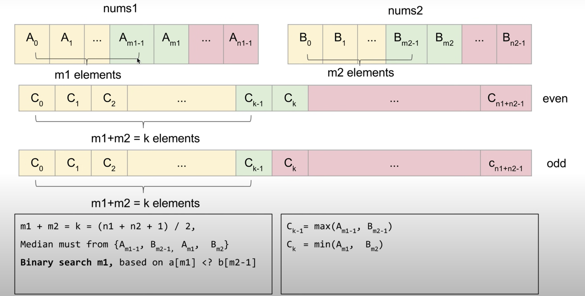

<!--
 * @Date: 2022-07-25 18:01:59
 * @LastEditors: zhangjiuchao zhangjiuchao@bytedance.com
 * @LastEditTime: 2022-07-27 09:11:26
-->
# 寻找两个正序数组的中位数
[https://leetcode.com/problems/median-of-two-sorted-arrays/](https://leetcode.com/problems/median-of-two-sorted-arrays/)
# 题目描述
```
Given two sorted arrays nums1 and nums2 of size m and n respectively, return the median of the two sorted arrays.

The overall run time complexity should be O(log (m+n)).

 

Example 1:

Input: nums1 = [1,3], nums2 = [2]
Output: 2.00000
Explanation: merged array = [1,2,3] and median is 2.
Example 2:

Input: nums1 = [1,2], nums2 = [3,4]
Output: 2.50000
Explanation: merged array = [1,2,3,4] and median is (2 + 3) / 2 = 2.5.
 

Constraints:

nums1.length == m
nums2.length == n
0 <= m <= 1000
0 <= n <= 1000
1 <= m + n <= 2000
-106 <= nums1[i], nums2[i] <= 106
```

# 解题思路

来源：[https://www.youtube.com/watch?v=KB9IcSCDQ9k](https://www.youtube.com/watch?v=KB9IcSCDQ9k)



假设n1=size(nums1),n2=size(nums2),且n1<n2

则中位数左边的数字个数为k = (n1+n2+1) / 2
这k个数中，num1中选择m1个元素，num2中选择前m2个元素，则m1+m2=k，且num1[m1] >= num2[m2-1]

因此中位数必来自于{A[m1-1], B[m2-1],
A[m1],B[m2]}:

- 如果n1+n2是基数，则中位数取$C_{k-1}=max(A_{m1-1},B_{m2-1})$

- 如果n1+n2是偶数，则中位数取$(C_{k-1} + C_k) * 0.5$, $C_k = min(A_{m1},B_{m2})$

使用二分查找算法搜索m1的值

# 代码实现
```c++
class Solution {
public:
    double findMedianSortedArrays(vector<int>& nums1, vector<int>& nums2) {
        int m = nums1.size(), n = nums2.size();
        if (m > n) return findMedianSortedArrays(nums2, nums1);
        
        int l = 0, r = m;
        int k = (m + n + 1) / 2;   // 中位数的位置
        while (l < r) {
            int i = l + (r - l) / 2;   // 中间位置
            int j = k - i;              // nums2中的partition
            if (nums1[i] < nums2[j-1]) {
                l = i + 1;
            } else {
                r = i;
            }
        }
        int i = l, j = k - i;
        int c1 = max(i > 0 ? nums1[i-1]: INT_MIN, j > 0 ? nums2[j-1]: INT_MIN);
        if ((m & 1) + (n & 1) == 1) return c1;
        int c2 = min(i < m ? nums1[i]: INT_MAX, j < n ? nums2[j]: INT_MAX);
        return (c1 + c2) * 0.5;
    }
};
```

算法复杂度: $log(n1+n2)$